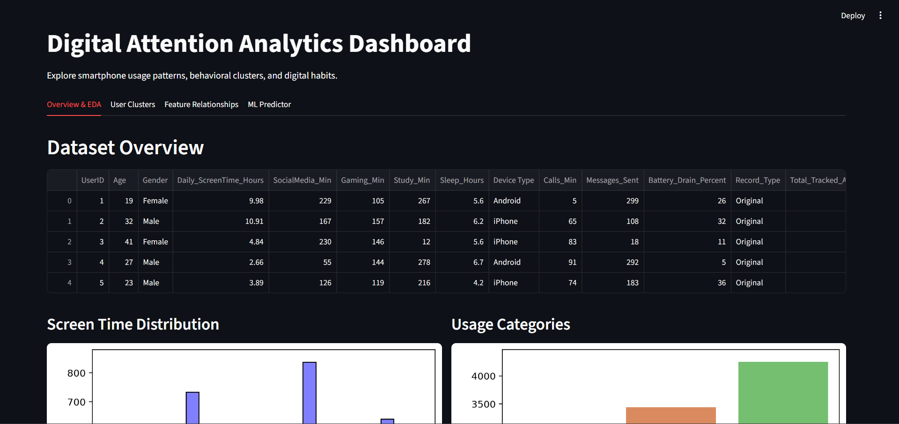
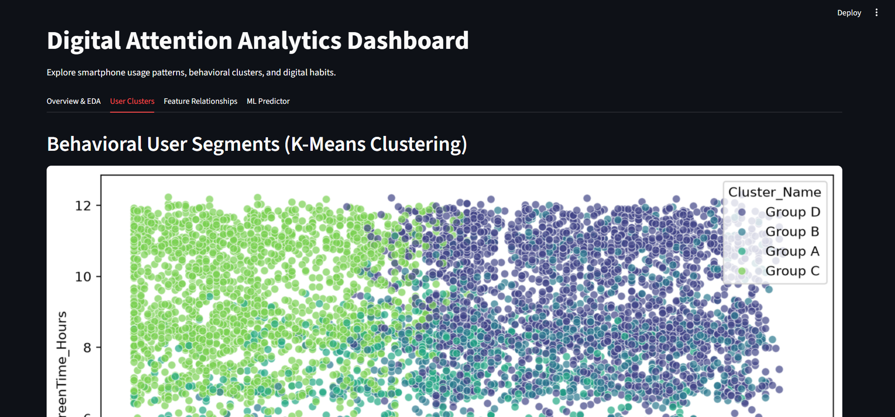
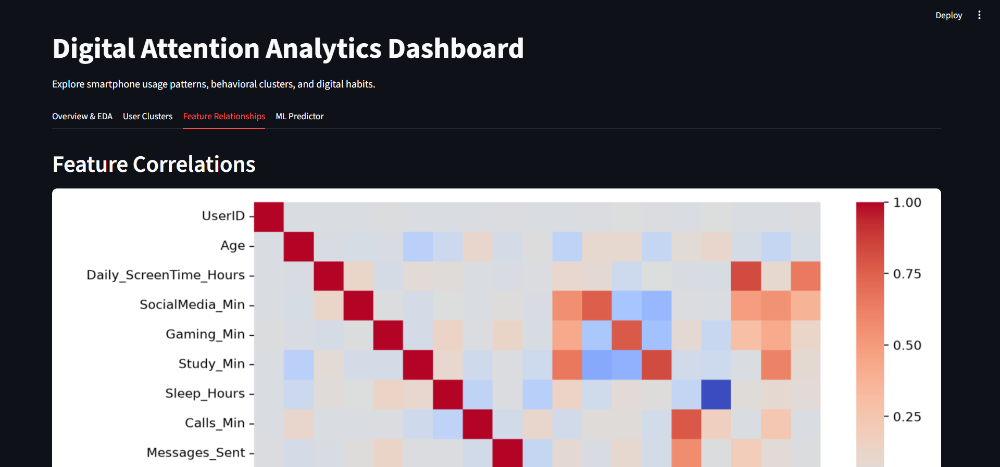
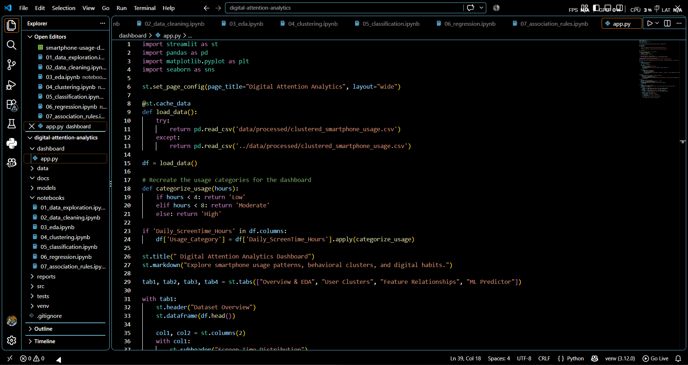
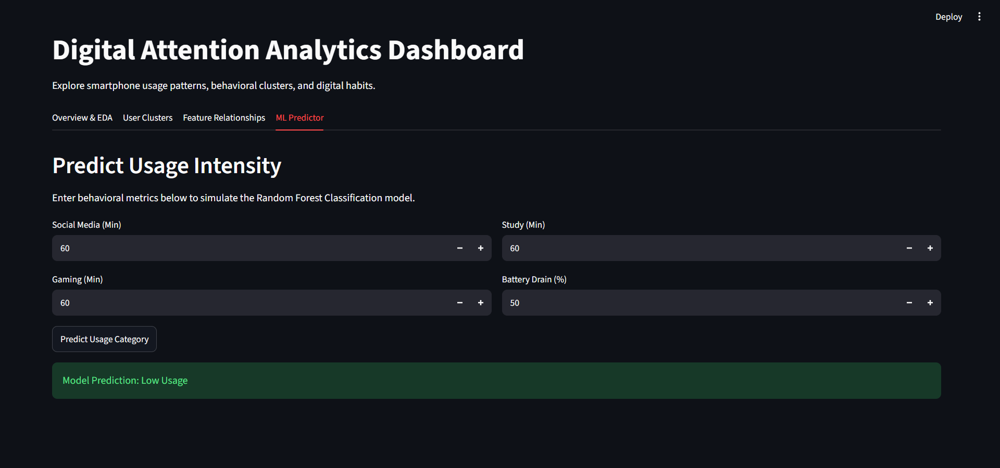

# Digital Attention Analytics


> **Understand digital behavior. Discover hidden patterns. Learn how data tells the story.**


Digital Attention Analytics is an end-to-end Data Science and Machine Learning project built to explore smartphone usage behavior in a deep, practical, and fascinating way.


Instead of looking at screen time as just a number, this project asks a broader question:


**What can we actually learn about digital behavior from everyday usage patterns?**


The project explores relationships between screen time, social media, gaming, study activity, sleep, communication, battery usage, device usage, and other behavioral signals. It combines data cleaning, exploratory analysis, visualization, feature engineering, clustering, classification, regression, feature importance, association-rule mining, and an interactive Streamlit dashboard.


The goal is not simply to train models, but to understand the complete journey:


**Raw Data → Cleaning → Exploration → Relationships → Features → Patterns → ML Models → Insights → Interactive Analysis**


---


## What This Project Explores


- How much time do users spend on their devices?

- Which digital activities are most strongly related to overall screen time?

- Are social media and gaming behavior connected with heavier device usage?

- Can users be grouped into distinct digital behavior profiles?

- Can a user's usage level be classified as **Low, Moderate, or High**?

- Can daily screen time be estimated from behavioral variables?

- Which features have the greatest influence on model predictions?

- What combinations of digital behaviors frequently occur together?

- What does the data reveal when we look beyond a single metric such as screen time?


---


## Project Objectives


1. **Understand the Dataset** — inspect structure, types, distributions, missing values, duplicates, and unusual values.

2. **Clean and Prepare the Data** — handle missing values, duplicates, categorical variables, and numerical values.

3. **Explore Digital Behavior** — use statistics and visualizations to understand usage patterns.

4. **Discover Feature Relationships** — analyze correlations among digital activities and lifestyle-related variables.

5. **Discover User Segments** — use clustering to identify groups with similar digital behavior.

6. **Classify Usage Intensity** — predict Low, Moderate, or High usage.

7. **Estimate Screen Time** — use regression to estimate daily screen time.

8. **Understand Feature Importance** — determine which variables contribute most to predictions.

9. **Discover Behavioral Combinations** — use association-rule mining to find recurring patterns.

10. **Make the Analysis Interactive** — expose the analysis and ML capabilities through Streamlit.


---


# What We Did


The project follows a complete Data Science workflow:


```text

Raw Data

   ↓

Data Cleaning

   ↓

Feature Engineering

   ↓

Exploratory Data Analysis

   ↓

Feature Relationships

   ↓

┌──────────────┬──────────────┬──────────────┐

│  Clustering  │Classification│  Regression  │

└──────────────┴──────────────┴──────────────┘

   ↓

Feature Importance

   ↓

Association Rules

   ↓

Interactive Streamlit Dashboard

```


---


# Dataset


The project uses a **10,000-record smartphone usage dataset** containing behavioral and device-related variables such as:


- User ID

- Age

- Gender

- Daily screen time

- Social media usage

- Gaming usage

- Study time

- Sleep duration

- Device type

- Calls

- Messages

- Battery drain

- Engineered behavioral features

- Usage-related categories


The expanded dataset is generated from the original behavioral data so that the project has enough observations for meaningful experimentation and visualization.


> **Important:** The expanded dataset is synthetic/generated data. It is intended for learning, experimentation, visualization, and demonstrating Data Science techniques rather than representing a real-world population.


---


# Data Science Workflow


## 1. Data Exploration


We inspect:


- Number of rows and columns

- Column names

- Data types

- Summary statistics

- Missing values

- Duplicate records

- Categorical and numerical variables

- Feature distributions


## 2. Data Cleaning


The workflow handles:


- Missing numerical values

- Missing categorical values

- Duplicate records

- Data types

- Numerical ranges

- Categorical preparation

- Consistent analysis/ML inputs


## 3. Feature Engineering


Additional behavioral features are derived from the available variables, including:


- `Total_Tracked_Activity_Hours`

- Usage-related categories

- Behavioral ratios

- Communication-related measures

- Sleep-related measures

- Usage intensity features


---


# Exploratory Data Analysis


EDA is used to visually understand the dataset before machine learning.


The project explores:


- Screen-time distributions

- Activity distributions

- Feature relationships

- Correlation matrices

- Behavioral differences

- Numerical feature distributions


Visualizations use **Matplotlib** and **Seaborn**.


---


# Feature Relationships


Correlation analysis helps investigate:


- Which variables move together

- Which activities are associated with screen time

- Whether gaming is associated with heavier device usage

- How study activity relates to other behaviors

- Relationships between sleep and digital activity


> Correlation does not automatically imply causation. The analysis is used to discover relationships rather than make causal claims.


---


# Clustering


Clustering discovers naturally occurring groups of users.


### Method


**K-Means Clustering**


Workflow:


1. Select behavioral features

2. Scale numerical features

3. Test different cluster counts

4. Apply the Elbow Method

5. Calculate Silhouette Score

6. Select a suitable number of clusters

7. Assign users to clusters

8. Interpret cluster behavior


The final analysis uses **4 clusters**.


---


# Classification


The classification task predicts:


```text

Low

Moderate

High

```


### Model


**Random Forest Classifier**


### Workflow


```text

Features + Target

       ↓

Train / Test Split

       ↓

Random Forest

       ↓

Predictions

       ↓

Evaluation

```


The project uses an **80/20 hold-out split**.


Evaluation includes:


- Accuracy

- Precision

- Recall

- F1-score

- Confusion Matrix


---


#  Regression


Regression estimates daily screen time from behavioral features.


### Model


**Random Forest Regressor**


### Evaluation


- MAE

- RMSE

- R² Score


Because the dataset is synthetic and daily screen time has a strong deterministic relationship with some behavioral variables, the regression score can be artificially high.


> The high R² should therefore be interpreted cautiously. It demonstrates the regression workflow while also showing why understanding the data-generation process matters when evaluating ML models.


---


#  Feature Importance


Feature importance helps answer:


**What is the model learning from?**


Social-media and gaming-related usage variables appear among the important predictors of overall screen-time behavior in the current analysis.


---


#  Association Rule Mining


The project uses the **Apriori Algorithm** to discover behavioral combinations.


Rules are evaluated using:


- Support

- Confidence

- Lift


The analysis can reveal recurring patterns such as higher gaming behavior being associated with higher overall screen-time behavior.


---


#  Interactive Dashboard


The Streamlit dashboard brings the analysis together through an interactive interface.


It includes:


- Dataset overview

- User-level exploration

- User clustering

- Feature relationships

- Visual analysis

- ML prediction

- Model-related insights


## Dashboard Screenshots


### Dashboard Overview





### User Clusters





### Feature Relationships





### Project File Structure





### ML Predictor





> Place these PNG files inside `docs/screenshots/` using the exact filenames above.


---


#  Project Structure


```text

digital-attention-analytics/

│

├── data/

│   ├── raw/

│   │   └── smartphone-usage-data.csv

│   ├── processed/

│   └── external/

│

├── notebooks/

│   ├── 01_data_exploration.ipynb

│   ├── 02_data_cleaning.ipynb

│   ├── 03_eda.ipynb

│   ├── 04_clustering.ipynb

│   ├── 05_classification.ipynb

│   ├── 06_regression.ipynb

│   └── 07_association_rules.ipynb

│

├── src/

│   ├── data/

│   ├── features/

│   ├── models/

│   ├── evaluation/

│   └── visualization/

│

├── models/

├── reports/

│   ├── figures/

│   └── results/

│

├── dashboard/

│

├── docs/

│   └── screenshots/

│       ├── Dashboard-overview.png

│       ├── User-clutters.png

│       ├── Feature-relationships.png

│       ├── Project-file.png

│       └── ML-predictor.png

│

├── tests/

├── requirements.txt

├── README.md

└── .gitignore

```


---


#  Tech Stack


| Technology | Purpose |

|---|---|

| Python | Core programming language |

| Pandas | Data manipulation and analysis |

| NumPy | Numerical computation |

| Matplotlib | Data visualization |

| Seaborn | Statistical visualization |

| Scikit-learn | Machine Learning |

| K-Means | User clustering |

| Random Forest | Classification and regression |

| Apriori | Association-rule mining |

| Jupyter Notebook | Interactive Data Science workflow |

| Streamlit | Interactive dashboard |

| Git / GitHub | Version control |


---


#  How to Use


## 1. Clone the Repository


```bash

git clone <your-repository-url>

cd digital-attention-analytics

```


## 2. Create a Virtual Environment


### Windows


```bash

python -m venv .venv

.venv\Scripts\activate

```


### macOS / Linux


```bash

python3 -m venv .venv

source .venv/bin/activate

```


## 3. Install Dependencies


```bash

pip install -r requirements.txt

```


## 4. Open in VS Code


Open the project folder in VS Code.


For notebooks:


1. Open `notebooks/`.

2. Open an `.ipynb` file.

3. Select the project's `.venv` Python environment as the Jupyter kernel.

4. Run cells from top to bottom.


---


#  Running the Dashboard


From the project root:


```bash

streamlit run dashboard/app.py

```


Then open the local Streamlit address shown in the terminal, normally:


```text

http://localhost:8501

```


---


#  Recommended Notebook Order


```text

01_data_exploration.ipynb

        ↓

02_data_cleaning.ipynb

        ↓

03_eda.ipynb

        ↓

04_clustering.ipynb

        ↓

05_classification.ipynb

        ↓

06_regression.ipynb

        ↓

07_association_rules.ipynb

```


**Understand → Clean → Explore → Discover → Predict → Interpret**


---


#  Key Results


The completed analysis demonstrates:


- **10,000 records** available for analysis

- **4 behavioral clusters** selected using Elbow Method and Silhouette Score

- Classification performance around **88% accuracy** with the Random Forest approach

- High regression R², with the synthetic-data limitation explicitly recognized

- Social-media and gaming variables among important predictors of screen-time behavior

- Association rules revealing recurring relationships between high gaming behavior and high overall screen-time behavior


These results demonstrate how different Data Science techniques reveal different aspects of the same dataset.


---


#  Why Multiple ML Techniques?


One model cannot answer every question.


### Classification


> **Which category does this user belong to?**


### Regression


> **What numerical value can we estimate?**


### Clustering


> **What groups naturally exist in the data?**


### Association Rules


> **What behaviors frequently occur together?**


### Feature Importance


> **Which variables matter most to the model?**


Together, they create a deeper understanding of digital behavior.


---


#  What This Project Helps You Understand


This project provides hands-on exposure to the complete Data Science lifecycle:


- Data loading

- Pandas DataFrames

- Data cleaning

- Missing-value handling

- Duplicate detection

- Exploratory Data Analysis

- Statistical summaries

- Correlation

- Feature engineering

- Feature scaling

- Categorical data handling

- Train/test splitting

- Hold-out validation

- Classification

- Regression

- Clustering

- Model evaluation

- Confusion matrices

- MAE / RMSE / R²

- Silhouette Score

- Elbow Method

- Feature importance

- Association rules

- Visualization

- Interactive dashboards

- Reproducible ML workflows


---


#  Limitations


### Synthetic Dataset


The expanded dataset is synthetic/generated. It is useful for learning and experimentation but should not be treated as a direct representation of real-world smartphone users.


### Regression Performance


The target variable has a strong relationship with some input behavioral variables, which can make the regression task easier than a genuine real-world prediction problem.


### Correlation ≠ Causation


A relationship between two variables does not prove that one causes the other.


### Generalization


Performance on synthetic data does not guarantee similar performance on unseen real-world populations.


---


#  Reproducibility


The project uses fixed random seeds where appropriate, including:


```text

random_state = 42

```


Relative paths are used so the project can be moved between machines more easily.


Dependencies are maintained in:


```text

requirements.txt

```


---


#  Project Philosophy


The most important part of this project is not a single model or a single accuracy score.


It is the process of asking better questions.


A dataset may initially look like a collection of numbers:


```text

Age

Screen Time

Gaming

Social Media

Study

Sleep

Calls

Messages

Battery

```


But analysis can transform those numbers into:


```text

Relationships

      ↓

Behavioral Patterns

      ↓

User Groups

      ↓

Predictions

      ↓

Insights

```


That transformation — **turning raw data into understanding** — is the core idea behind Digital Attention Analytics.


---


# Future Possibilities


Possible extensions include:


- Time-series smartphone usage analysis

- Daily or weekly behavior trends

- More advanced clustering techniques

- Comparison of multiple ML algorithms

- Hyperparameter optimization

- Explainable AI techniques

- Anomaly detection

- Interactive user profiling

- More sophisticated association analysis

- Real-time data ingestion

- Personalized digital-behavior insights


These are optional directions rather than requirements of the current project.


---


#  Author


**Venu**


Built with curiosity to understand how data, patterns, and machine learning can reveal the hidden structure behind everyday digital behavior.


---


##  Final Thought


> **Don't just ask what the data says. Ask why it says it — and what else it might be hiding.**